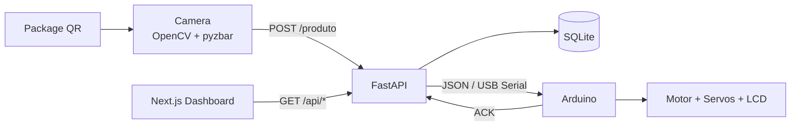

# Conveyor QR Automation System

End-to-end academic automation project that combines **computer vision, FastAPI, SQLite, USB serial communication, Arduino actuators and a Next.js monitoring dashboard** to inspect and route packages from QR-code data.

> Computer Engineering final project — FAMETRO, Manaus, Brazil.

## What this project demonstrates

This repository is intended to show more than a CRUD application. It connects software to physical hardware:

1. a camera captures and decodes a QR code;
2. the camera client sends the package payload to FastAPI;
3. the backend validates the category and stores the event in SQLite;
4. the backend sends a versioned JSON command over USB serial;
5. Arduino controls the conveyor routing servo and LCD;
6. Arduino returns an ACK;
7. the Next.js dashboard reads processing metrics from the API.

## Architecture



The API is deliberately the **single owner of the serial port**. This avoids duplicate commands and port contention between the camera process and the backend.

More detail: [docs/architecture.md](docs/architecture.md)

## Components

| Area | Technology | Responsibility |
| --- | --- | --- |
| Vision | Python, OpenCV, pyzbar | Capture frames and decode QR payloads |
| Backend | Python, FastAPI, Pydantic | Validation, orchestration and metrics API |
| Persistence | SQLite | Local processing history |
| Hardware bridge | PySerial | USB serial transport |
| Firmware | Arduino, ArduinoJson | Conveyor motor, servos and LCD |
| Web dashboard | Next.js, React, Recharts | Live metrics and recent package history |
| Mobile prototype | React Native, Expo | Earlier UI prototype kept for project history |

## Repository structure

```text
.
├── api/                  # FastAPI backend, dependencies and demo seed
├── camera/               # QR camera client
├── Arduino/
│   └── esteira/          # Active conveyor firmware
├── dashboard/            # Integrated Next.js dashboard
├── app/                  # Earlier React Native UI prototype
├── docs/                 # Architecture, protocol and demo guidance
├── .env.example          # Local configuration template
└── SECURITY.md           # Security and deployment guidance
```

## Quick start — software demo without hardware

The default configuration uses **simulation mode**, so the backend and dashboard can be demonstrated without an Arduino connected.

### 1. Python environment

macOS / Linux:

```bash
python3 -m venv .venv
source .venv/bin/activate
pip install -r api/requirements.txt
cp .env.example .env
```

Windows PowerShell:

```powershell
py -m venv .venv
.\.venv\Scripts\Activate.ps1
pip install -r api/requirements.txt
Copy-Item .env.example .env
```

### 2. Seed sanitized demonstration data

```bash
python -m api.seed_demo --reset
```

The generated `api/pacotes.db` is runtime data and is intentionally ignored by Git.

### 3. Start the API

```bash
uvicorn api.api:app --reload --host 127.0.0.1 --port 8000
```

Health check:

```text
GET http://127.0.0.1:8000/api/health
```

Interactive API documentation:

```text
http://127.0.0.1:8000/docs
```

### 4. Start the dashboard

```bash
cd dashboard
npm install
npm run dev
```

Open `http://localhost:3000`.

> The dashboard dependency tree is committed in `package-lock.json`; CI verifies a clean `npm ci`, runtime audit, lint and production build.

## Camera client

The camera client expects QR codes whose payload is JSON:

```json
{
  "produto_id": "DEMO-001",
  "categoria": "smartphones",
  "descricao": "Smartphone de demonstração",
  "peso": 0.45,
  "altura": 15
}
```

Run:

```bash
python camera/main.py
```

`pyzbar` requires the native **zbar** library on the operating system.

The camera does **not** talk directly to Arduino. It sends the decoded payload to the API, which owns validation, persistence and hardware control.

## Hardware mode

Set in `.env`:

```dotenv
SERIAL_ENABLED=true
ARDUINO_PORT=/dev/cu.usbserial-120
BAUD_RATE=9600
```

On Windows, `ARDUINO_PORT` will usually look like `COM3` or another COM port.

The active firmware is:

```text
Arduino/esteira/esteira.ino
```

Arduino dependencies and pin assumptions are documented in [Arduino/README.md](Arduino/README.md).

## Serial protocol

Commands use one UTF-8 JSON document per line at **9600 baud**.

Example command:

```json
{
  "version": 1,
  "command": "sort",
  "produto_id": "DEMO-001",
  "categoria": "smartphones",
  "status": "Válido"
}
```

Example ACK:

```json
{
  "ok": true,
  "produto_id": "DEMO-001"
}
```

Full contract: [docs/serial-protocol.md](docs/serial-protocol.md)

## API endpoints

| Method | Endpoint | Purpose |
| --- | --- | --- |
| GET | `/api/health` | Runtime health/config status |
| POST | `/produto` | Validate, persist and optionally route one package |
| GET | `/api/status` | Valid/invalid totals |
| GET | `/api/ultimos_produtos` | Recent package history |
| GET | `/api/total_itens` | Total processed |
| GET | `/api/total_validos` | Total valid |
| GET | `/api/total_invalidos` | Total invalid |
| GET | `/api/taxa_sucesso` | Percentage of accepted categories |
| GET | `/api/categories` | Counts by category |
| GET | `/api/time` | Counts grouped by hour |

## Security posture

Runtime databases, logs, environment files, Python bytecode, build output and OS metadata are ignored by Git.

`POST /produto` can trigger physical movement when hardware mode is enabled. For any deployment beyond the local machine:

- set a strong `API_TOKEN`;
- restrict `CORS_ORIGINS`;
- serve behind HTTPS;
- apply network access control and appropriate rate limiting.

See [SECURITY.md](SECURITY.md).

## Demonstration media

A short GIF showing **QR read → API → conveyor routing → dashboard update** will be the primary visual demo for the portfolio.

The capture plan is documented in [docs/demo-guide.md](docs/demo-guide.md). Raw large videos should not be committed directly to Git history.

## Verification

Repository hygiene:

```bash
git ls-files | grep -E '(^|/)\.DS_Store$|__pycache__|\.pyc$|\.log$|\.db$'
```

The command should return no tracked runtime artifacts.

Python:

```bash
python -m compileall api camera
pip check
```

Dashboard:

```bash
cd dashboard
npm audit --omit=dev
npm run build
```

Arduino, after confirming the exact board FQBN:

```bash
arduino-cli compile --fqbn <BOARD_FQBN> Arduino/esteira
```

## Academic context and authorship

Developed as a Computer Engineering final project at **Faculdade Metropolitana de Manaus (FAMETRO)**.

Project authors:

- Mateus Arce
- Tiago Henrique

## Project status

The repository has been reorganized for portfolio use while preserving the original project history. The React Native application under `app/` is retained as an earlier prototype; the Next.js dashboard is the primary integrated monitoring interface.

No open-source license has been selected yet.
