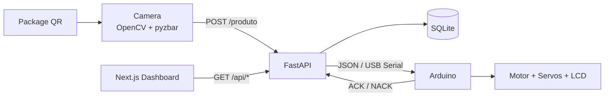
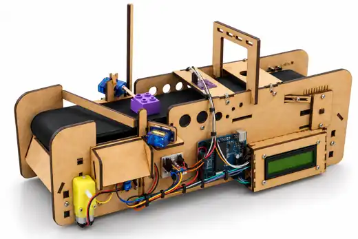

# Conveyor QR Automation System

[](https://github.com/mateusarcedev/tcc/actions/workflows/ci.yml)

An end-to-end **computer vision + backend + embedded systems** project that reads package QR codes, validates and stores processing events, sends routing commands to an Arduino conveyor, and exposes live metrics in a Next.js dashboard.

> Computer Engineering final project — FAMETRO, Manaus, Brazil.

## 30-second tour

```text
QR package
   ↓
OpenCV + pyzbar
   ↓
FastAPI
   ├── validates category
   ├── persists event in SQLite
   └── sends JSON command over USB serial
                     ↓
                  Arduino
                     ↓
          motor + routing servos + LCD

Next.js dashboard ← metrics API
```

The project can be demonstrated **without physical hardware** using simulation mode and Docker Compose.

```bash
docker compose up --build
```

Open:

- Dashboard: `http://localhost:3000`
- API docs: `http://localhost:8000/docs`

Then run the same verified integration flow used by CI:

```bash
docker compose --profile tools run --rm demo
```

Expected result:

```text
+3 processed
+2 valid
+1 invalid

VERIFY PASSED: API demo produced the expected state transitions.
```

## What this project demonstrates

| Capability | Implementation |
| --- | --- |
| Computer vision | OpenCV camera capture + pyzbar QR decoding |
| Backend orchestration | FastAPI + Pydantic validation |
| Persistence | SQLite processing history and aggregate queries |
| Hardware integration | Versioned JSON over USB serial with ACK/NACK |
| Embedded control | Arduino motor, two routing servos and 16x2 I2C LCD |
| Frontend | Next.js + React + Recharts monitoring dashboard |
| Reproducibility | Docker Compose software demo |
| Quality gates | Python tests, HTTP integration test, dashboard audit/lint/build, firmware compile and container smoke test in CI |

This is intentionally more than a CRUD demo: the backend is the coordination point between **camera input, persistence, physical actuation and monitoring**.

## Architecture



The API is the **single owner of the serial port**, avoiding duplicated hardware commands and serial-port contention.

Detailed architecture: [docs/architecture.md](docs/architecture.md)

## Demo options

| Mode | Hardware required | Best use |
| --- | --- | --- |
| Docker Compose | No | Fastest portfolio/reviewer setup |
| Native simulation | No | Backend/dashboard development |
| Camera + simulation | Camera only | QR decoding demonstration |
| Full hardware | Arduino + conveyor + camera | Physical end-to-end demonstration |

### Docker demo

```bash
docker compose up --build
docker compose --profile tools run --rm demo
```

Docker explicitly keeps `SERIAL_ENABLED=false`; no USB device is exposed to the stack.

Guide: [docs/docker-demo.md](docs/docker-demo.md)

### Native software demo

Create the Python environment:

```bash
python3 -m venv .venv
source .venv/bin/activate
pip install -r api/requirements.txt
cp .env.example .env
```

Windows PowerShell:

```powershell
py -m venv .venv
.\.venv\Scripts\Activate.ps1
pip install -r api/requirements.txt
Copy-Item .env.example .env
```

Start the API:

```bash
uvicorn api.api:app --reload --host 127.0.0.1 --port 8000
```

Run the verification demo in another terminal:

```bash
python scripts/demo_api.py --verify
```

The script refuses to send package commands when hardware mode is enabled unless `--allow-hardware` is explicitly supplied.

Guide: [docs/software-demo.md](docs/software-demo.md)

## QR payload

The camera client expects JSON inside the QR code:

```json
{
  "produto_id": "DEMO-001",
  "categoria": "smartphones",
  "descricao": "Smartphone de demonstração",
  "peso": 0.45,
  "altura": 15
}
```

Supported routing categories:

- `smartphones`
- `tablets`

Other categories are stored as `Inválido`.

Run the camera client:

```bash
python camera/main.py
```

The camera only decodes QR data and calls the API. It does **not** own the Arduino serial connection.

> `pyzbar` requires the native `zbar` library on the operating system.

## Hardware mode

Configure `.env`:

```dotenv
SERIAL_ENABLED=true
ARDUINO_PORT=/dev/cu.usbserial-120
BAUD_RATE=9600
```

On Windows, the serial port will typically be a COM port such as `COM3`.

The active firmware is:

```text
Arduino/esteira/esteira.ino
```

Known control interfaces:

| Component | Configuration |
| --- | --- |
| Servo 1 | pin 12 |
| Servo 2 | pin 13 |
| Conveyor motor control | PWM pin 6 |
| LCD | I2C `0x27`, 16x2 |
| Serial | 9600 baud |

The exact original Arduino board model was not preserved in the historical repository. CI compiles against `arduino:avr:uno` only as a **reference compatibility target**, not as a claim about the original hardware.

Hardware reconstruction: [docs/hardware.md](docs/hardware.md)  
Firmware setup: [Arduino/README.md](Arduino/README.md)  
Serial contract: [docs/serial-protocol.md](docs/serial-protocol.md)

## API

| Method | Endpoint | Purpose |
| --- | --- | --- |
| GET | `/api/health` | Runtime database + serial mode health |
| POST | `/produto` | Validate, persist and optionally route a package |
| GET | `/api/status` | Valid/invalid totals |
| GET | `/api/ultimos_produtos` | Recent processing history |
| GET | `/api/total_itens` | Total processed |
| GET | `/api/total_validos` | Total valid |
| GET | `/api/total_invalidos` | Total invalid |
| GET | `/api/taxa_sucesso` | Valid percentage |
| GET | `/api/categories` | Counts by category |
| GET | `/api/time` | Counts grouped by hour |

Interactive OpenAPI documentation is available at `/docs` while the API is running.

## Repository structure

```text
.
├── api/                  # FastAPI backend, SQLite and tests
├── camera/               # OpenCV/pyzbar QR client
├── Arduino/
│   └── esteira/          # Conveyor firmware
├── dashboard/            # Next.js monitoring dashboard
├── scripts/              # Executable integration demo
├── docs/                 # Architecture, hardware and demo docs
├── app/                  # Earlier React Native prototype
├── docker-compose.yml    # Reproducible software demo
├── .env.example          # Local configuration
└── SECURITY.md           # Security guidance
```

## Continuous integration

The `CI` workflow validates four independent areas on every pull request:

1. **Python**
   - dependency installation
   - source compilation
   - unit tests
   - dependency consistency
   - real `uvicorn + HTTP + SQLite` integration demo

2. **Dashboard**
   - reproducible `npm ci`
   - runtime dependency audit
   - ESLint
   - production Next.js build

3. **Firmware**
   - Arduino CLI setup
   - pinned firmware libraries
   - AVR reference compilation

4. **Containers**
   - Compose config validation
   - API/dashboard image builds
   - service health checks
   - container-to-container demo verification
   - clean teardown

## Security

Runtime databases, logs, environment files, Python bytecode, build output and OS metadata are excluded from version control.

`POST /produto` can trigger physical movement when hardware mode is enabled. For use beyond localhost:

- set a strong `API_TOKEN`;
- restrict `CORS_ORIGINS`;
- terminate traffic with HTTPS;
- apply network access control and rate limiting.

See [SECURITY.md](SECURITY.md).

## Visual reconstruction



> **3D reconstruction:** this image was created from photographs of the original prototype and reference images of the conveyor kit. It is a visual reconstruction for documentation and portfolio presentation, **not a photograph or recording of a physical run**.

The software path is fully reproducible and continuously verified in CI. A real video/GIF of the original conveyor operating is not currently available.

If original footage is recovered in the future, it can be added separately as physical demo evidence. See [docs/media/README.md](docs/media/README.md).

## Academic context

Developed as a Computer Engineering final project at **Faculdade Metropolitana de Manaus (FAMETRO)**.

Authors:

- Mateus Arce
- [Tiago Henrique](https://github.com/tiagohenriquee)

The React Native application under `app/` is preserved as an earlier prototype. The Next.js dashboard is the primary integrated monitoring interface.

## License

This project is licensed under the [MIT License](LICENSE).
