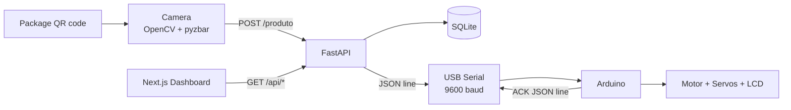

# Architecture

## Purpose

This project demonstrates an end-to-end hardware + software automation pipeline for package inspection and routing using QR codes.

The design intentionally gives each process one clear responsibility:

- **Camera client:** captures frames, decodes QR codes and sends package data to the API.
- **FastAPI backend:** validates packages, owns the serial connection, persists events and exposes read-only metrics.
- **Arduino firmware:** receives one JSON command per line and controls the conveyor motor, servos and LCD.
- **SQLite:** stores local processing events.
- **Next.js dashboard:** reads API metrics and recent processing history.
- **React Native app:** preserved as an earlier UI prototype; it is not the primary integrated dashboard.

## Runtime flow



## Important design decision: one serial owner

The API is the **only process allowed to open the Arduino serial port**.

The previous implementation allowed both the camera process and the API to open the same USB serial device. That could cause port contention and duplicate actuator commands.

The camera now communicates only through HTTP:

```text
Camera -> FastAPI -> Arduino
```

This also centralizes category validation and hardware control in one service.

## Trust boundaries

By default, the project is intended to run on one developer machine:

- API: `127.0.0.1:8000`
- Dashboard: `localhost:3000`
- Serial: local USB device
- Database: local SQLite file

If the API is exposed to a LAN or the internet:

1. set a strong `API_TOKEN`;
2. restrict `CORS_ORIGINS`;
3. place the service behind HTTPS;
4. add network-level access controls;
5. do not expose the serial-control endpoint anonymously.

## Data model

The local database creates one table:

```sql
CREATE TABLE pacotes (
    id INTEGER PRIMARY KEY AUTOINCREMENT,
    produto_id TEXT NOT NULL,
    categoria TEXT NOT NULL,
    descricao TEXT NOT NULL,
    peso REAL NOT NULL,
    altura REAL NOT NULL,
    status TEXT NOT NULL,
    timestamp TEXT NOT NULL
);
```

Runtime database files are intentionally ignored by Git. Use `python -m api.seed_demo --reset` to populate sanitized demonstration data.

## Failure behavior

- If the camera cannot reach the API, no hardware command is sent.
- If hardware mode is enabled and the serial controller cannot be reached, `POST /produto` returns HTTP 503.
- Invalid QR JSON is ignored by the camera client.
- Invalid serial JSON or missing required fields produces an Arduino NACK.
- With `SERIAL_ENABLED=false`, the backend runs in simulation mode and still supports dashboard/demo usage.


## Idempotency transaction boundary

Package processing uses a SQLite `BEGIN IMMEDIATE` transaction before checking `produto_id`.

This matters because an application-only lock protects only one Python process. The database transaction serializes competing package writes for all API processes that share the same SQLite file:

```text
BEGIN IMMEDIATE
  -> check produto_id
  -> send hardware command
  -> require correlated ACK
  -> insert processing event
COMMIT
```

A concurrent request waits for the transaction. After the first request commits, the waiting request sees the existing `produto_id` and follows the idempotent replay path instead of issuing another hardware command.

`DATABASE_BUSY_TIMEOUT_SECONDS` controls how long SQLite waits for the write reservation (default: 10 seconds). If the database remains busy, the API returns HTTP 503 rather than silently bypassing idempotency.

The hardware deployment should still use a single API process as the serial-port owner. The database transaction is defense-in-depth for concurrent HTTP execution and shared-database deployments; it does not turn a USB serial device into a multi-process resource.
