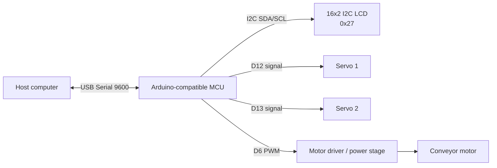

# Hardware

## What is known from the repository

The historical source code records the electrical interfaces used by the prototype, but it does **not** record the exact Arduino board model or the exact commercial model of every peripheral.

The former macOS serial path:

```text
/dev/cu.usbserial-120
```

only proves that the host saw a USB serial device. It is not enough to distinguish an Arduino Uno, Nano, Mega, compatible clone, or an external USB-to-serial adapter.

For that reason, this documentation intentionally separates **confirmed project facts** from **reference assumptions used by CI**.

## Confirmed logical BOM

| Component | Evidence in code | Known configuration |
| --- | --- | --- |
| Arduino-compatible controller | Arduino sketch + USB serial | 9600 baud |
| Conveyor DC motor / drive stage | PWM output in firmware | control signal on pin 6 |
| Routing servo 1 | Servo library | signal on pin 12 |
| Routing servo 2 | Servo library | signal on pin 13 |
| Character LCD | `LiquidCrystal_I2C` | 16x2, I2C address `0x27` |
| Host camera | OpenCV `VideoCapture(0)` | camera index 0 |
| Host computer | Python + USB serial | runs camera client and FastAPI |

## Details not preserved in the historical repository

The following should be filled in if the original prototype or purchase records are still available:

| Item | Status |
| --- | --- |
| Exact Arduino board/model | Not recovered |
| MCU/chip | Not recovered |
| Motor driver / transistor / H-bridge model | Not recovered |
| DC motor voltage/current | Not recovered |
| Servo models | Not recovered |
| External power supply rating | Not recovered |
| Camera model | Not recovered |
| LCD backpack controller | Not recovered |
| Mechanical conveyor dimensions | Not recovered |

## Reference CI target

Firmware CI compiles the sketch against:

```text
arduino:avr:uno
```

This is a **compatibility target only**. It proves that the current sketch is syntactically valid and fits a common AVR Arduino target. It must not be interpreted as evidence that the original TCC used an Arduino Uno.

Once the original board is confirmed, replace or extend this target with the correct FQBN.

## Logical wiring



The repository only proves the **control signals** above. Power wiring and the exact motor-drive circuit are not available in the source history.

## Hardware safety

A DC motor must not be powered directly from an Arduino GPIO pin. Use an appropriate driver/power stage sized for the motor, provide suitable flyback protection when required, and share ground between the controller and external drive circuit.

Servos may also require a separate regulated supply depending on current draw. Do not assume the Arduino USB rail is sufficient for two servos plus the rest of the mechanism.

## What to photograph for the portfolio

To complete this document later, capture:

1. one wide photo of the complete conveyor;
2. one close-up of the controller board showing its model;
3. one photo of the motor driver/power stage;
4. one photo showing the two routing servos;
5. one photo of the LCD and wiring;
6. one photo of the camera position.

These photos will let the BOM and wiring section be converted from reconstructed documentation into exact hardware documentation.
